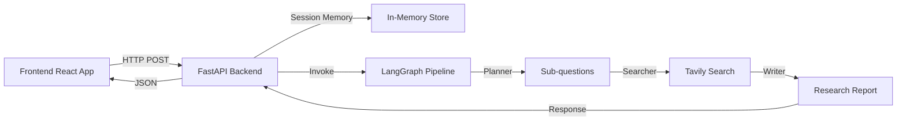

# Deep Research AI - Milestone 3: UI and Memory Integration

A production-quality, ChatGPT-like web interface for an agentic AI research system powered by LangGraph.

## 🌟 Features

- **Modern ChatGPT-Style UI**: Premium dark-mode interface with glassmorphism effects
- **AI-Powered Research**: Multi-agent pipeline (Planner → Searcher → Writer)
- **Session Memory**: Persistent conversation history with context-aware responses
- **Real-time Interaction**: Smooth animations, typing indicators, and auto-scroll
- **Markdown Support**: Formatted research reports with headings, lists, and emphasis
- **Copy-to-Clipboard**: Easy sharing of research results

## 🏗️ Architecture



### Components

**Backend** (`/backend`)
- `main.py`: FastAPI application with CORS and endpoints
- `models.py`: Pydantic request/response models
- `memory.py`: Thread-safe session memory manager

**Frontend** (`/frontend`)
- `App.jsx`: Main application with state management
- `components/Header.jsx`: App header with branding
- `components/MessageBubble.jsx`: Message display with markdown
- `components/ChatInput.jsx`: Multi-line input with shortcuts
- `components/TypingIndicator.jsx`: Animated loading indicator

**Research Pipeline** (`/src`)
- `graph/research_graph.py`: LangGraph workflow
- `agents/planner.py`: Query decomposition
- `agents/searcher.py`: Web search with Tavily
- `agents/writer.py`: Report generation

## 🚀 Setup Instructions

### Prerequisites

- Python 3.9+
- Node.js 18+
- npm or yarn

### Environment Variables

Create a `.env` file in the project root:

```env
# LLM Configuration
LLM_API_URL=https://api.openai.com/v1
LLM_API_KEY=your_openai_api_key
MODEL_NAME=gpt-4

# Tavily Search API
TAVILY_API_KEY=your_tavily_api_key
```

### Backend Setup

1. Install Python dependencies:
```bash
pip install -r requirements.txt
```

2. Start the backend server:
```bash
cd backend
python -m uvicorn main:app --reload
```

Or use the startup script:
```bash
cd backend
start.bat  # Windows
```

Backend will run on: `http://localhost:8000`

### Frontend Setup

1. Install Node dependencies:
```bash
cd frontend
npm install
```

2. Start the development server:
```bash
npm run dev
```

Or use the startup script:
```bash
cd frontend
start.bat  # Windows
```

Frontend will run on: `http://localhost:5173`

## 📡 API Endpoints

### `POST /research`
Process a research query with session memory.

**Request:**
```json
{
  "message": "Explain quantum computing",
  "session_id": "uuid-v4-string"
}
```

**Response:**
```json
{
  "response": "# Quantum Computing\n\n**Executive Summary**...",
  "session_id": "uuid-v4-string",
  "timestamp": "2026-01-09T22:00:00.000Z"
}
```

### `GET /health`
Health check endpoint.

### `GET /session/new`
Generate a new session ID.

### `POST /session/clear`
Clear conversation history for a session.

## 🎨 UI Features

### Design Elements
- **Dark Mode Theme**: Gradient background with glassmorphism
- **Premium Typography**: Inter font family
- **Smooth Animations**: Framer Motion for message transitions
- **Custom Scrollbar**: Styled scrollbar for better aesthetics
- **Responsive Layout**: Works on desktop and mobile

### Interactions
- **Enter**: Send message
- **Shift + Enter**: New line
- **Copy Button**: Copy assistant responses
- **Clear Chat**: Reset conversation
- **Auto-scroll**: Always shows latest message

## 🔧 Session Memory

The system maintains conversation context across multiple turns:

1. **Session Creation**: Unique UUID generated on first visit
2. **LocalStorage**: Session ID persisted in browser
3. **Context Injection**: Previous messages inform new responses
4. **Thread Safety**: Concurrent request handling with locks
5. **Auto-cleanup**: Expired sessions removed (24-hour timeout)

## 🧪 Testing

### Manual Testing

1. **Single Query Test**:
   - Open `http://localhost:5173`
   - Send: "What is machine learning?"
   - Verify formatted response appears

2. **Multi-turn Conversation**:
   - Send: "Explain neural networks"
   - Send: "How do they differ from traditional algorithms?"
   - Verify context is maintained

3. **Session Persistence**:
   - Send a message
   - Refresh the page
   - Verify conversation history persists

4. **Error Handling**:
   - Stop backend server
   - Send a message
   - Verify error message displays

## 📦 Project Structure

```
OpenDeepResearcher_project/
├── backend/
│   ├── main.py              # FastAPI application
│   ├── models.py            # Pydantic models
│   ├── memory.py            # Session memory
│   └── start.bat            # Startup script
├── frontend/
│   ├── src/
│   │   ├── components/      # React components
│   │   ├── App.jsx          # Main app
│   │   ├── main.jsx         # Entry point
│   │   └── index.css        # Global styles
│   ├── package.json
│   ├── vite.config.js
│   ├── tailwind.config.js
│   └── start.bat            # Startup script
├── src/
│   ├── agents/              # AI agents
│   ├── graph/               # LangGraph pipeline
│   └── utils/
├── requirements.txt
└── README.md
```

## 🎯 Usage Example

1. Start both backend and frontend servers
2. Open browser to `http://localhost:5173`
3. Type your research query: "Future of renewable energy"
4. Wait for the AI to research and generate a comprehensive report
5. Ask follow-up questions to dive deeper
6. Copy results using the copy button
7. Clear conversation when starting a new topic

## 🚀 Production Deployment

For production use:

1. **Backend**:
   - Use production ASGI server (Gunicorn + Uvicorn)
   - Migrate to Redis for session storage
   - Add rate limiting and authentication
   - Enable HTTPS

2. **Frontend**:
   - Build production bundle: `npm run build`
   - Serve with Nginx or CDN
   - Update API_BASE_URL to production endpoint
   - Enable analytics and monitoring

## 🤝 Contributing

This is Milestone 3 of the Deep Research AI project. Future enhancements:
- Streaming responses
- Export to PDF/Markdown
- Multi-language support
- Voice input
- Research history dashboard

## 📄 License

MIT License - See LICENSE file for details

---

**Built with ❤️ using React, FastAPI, and LangGraph**
